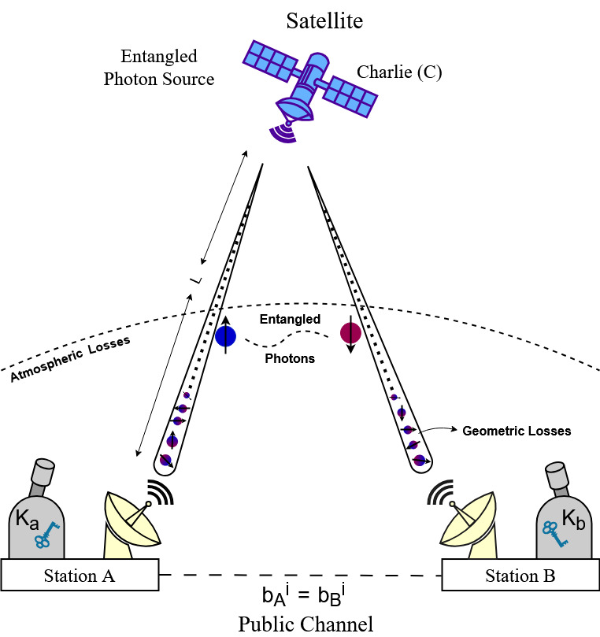

# BBM92 Quantum Key Distribution Simulator 🔐⚛️

This project implements the BBM92 quantum key distribution (QKD) protocol using Python and Qiskit. It simulates secure entanglement-based communication for satellite-to-ship scenarios in a free-space quantum channel, modeling realistic factors such as atmospheric loss, noise, and eavesdropping.

> Developed as part of a research initiative on quantum satellite-vehicular communication.

---

## 📌 Features

- ✅ BBM92 protocol with entangled qubit generation and basis reconciliation
- ✅ Atmospheric loss modeling using Beer-Lambert law
- ✅ Eavesdropper (Eve) simulation with basis mismatch and interception
- ✅ QBER (Quantum Bit Error Rate), SKR (Secret Key Rate), and throughput calculation
- ✅ SNR (Signal-to-Noise Ratio) analysis
- ✅ Comparative visualizations between **BBM92** and **MDI-QKD** (optional)
- ✅ Graphs: `QBER vs Distance`, `SKR vs Distance`, and more
- ✅ Realistic noise simulation using `qiskit_aer.noise`

---

## 🖼️ Project Architecture



---

## 📊 Visualizations

### 🔷 QBER vs Distance (No Eve, No Noise)


### 🔷 Secret Key Rate vs Distance


---

## 🧪 Installation & Setup

```bash
pip install qiskit
pip install qiskit_aer
pip install matplotlib
pip install qiskit_ibm_runtime
```

---

## ▶️ How to Run

```bash
python bbm92_simulator.py
```

Or run it in a [Google Colab notebook](https://chatgpt.com/c/684a9674-3b94-800b-abd0-39303f567fb5#) if you're using this for education/demo purposes.

---

## 🧠 What is BBM92?

The BBM92 protocol uses entangled photon pairs for secure key exchange. It is an entanglement-based variant of BB84 and is resilient against photon-number-splitting attacks.

---


## 📦 Code Structure

This repository implements a simulation of the **BBM92 quantum key distribution protocol** using Qiskit. The code is organized into two main Python classes:

### 1. `BBM92Protocol`

This is the core class that simulates the BBM92 QKD protocol over a free-space quantum channel. It includes:

- **Initialization** with parameters such as number of qubits, noise configuration, and simulation time.
    
- **Entanglement generation** via Bell pairs using Hadamard and CNOT gates.
    
- **Eavesdropper simulation** that optionally intercepts and resends qubits.
    
- **Noise modeling** using Qiskit Aer’s depolarizing error model.
    
- **Basis reconciliation** to filter matching measurement bases between Alice and Bob.
    
- **Key metrics computation** including Bit Error Rate (BER), total QBER, Shannon entropy, throughput, and Secret Key Rate (SKR).
    
- **Atmospheric loss modeling** using geometric divergence and the Beer–Lambert law.
    
- **Signal-to-Noise Ratio (SNR)** estimation based on final key and noise levels.
    
- **`run_protocol()`**: The main simulation function that runs all steps and returns protocol metrics.
    

### 2. `BBM92ProtocolWithPlots` (inherits from `BBM92Protocol`)

An extension of the core class that adds visualization features:

- **`plot_skr_vs_distance()`**: Simulates the protocol over varying distances and plots the secret key rate (SKR) vs. distance.
    
- **`plot_qber_vs_distance()`**: Plots the total QBER vs. distance, helping analyze protocol reliability at different communication ranges.
    

### 3. Main Script Execution

At the bottom of the script:

- An instance of `BBM92Protocol` is created.
    
- The protocol is executed with options to include noise or an eavesdropper.
    
- Results such as key length, SKR, QBER, throughput, and SNR are printed.
    
---


## 📈 Sample Output

```
Final key length: 16
Secret key rate: 3489
Throughput: 17.892
Bit Error Rate: 0.029
Total QBER: 0.042
Total Atmospheric Loss: 18.231 dB
Eavesdropping detected: False
SNR: 2.942
```

---

## 📁 Project Structure

```
├── bbm92_simulator.py         # Core BBM92 implementation
├── diagrams/                  # Graphs and architecture diagrams
└── README.md
```

---

## 📚 Research Context

This simulator was developed as part of a research paper on **Quantum Satellite-Ship Communication using BBM92 and MDI-QKD protocols**.

---

## 🛡️ License

This project is licensed under the [MIT License](https://github.com/fjiolla/bbm92-qkd-simulator/blob/main/LICENSE).
